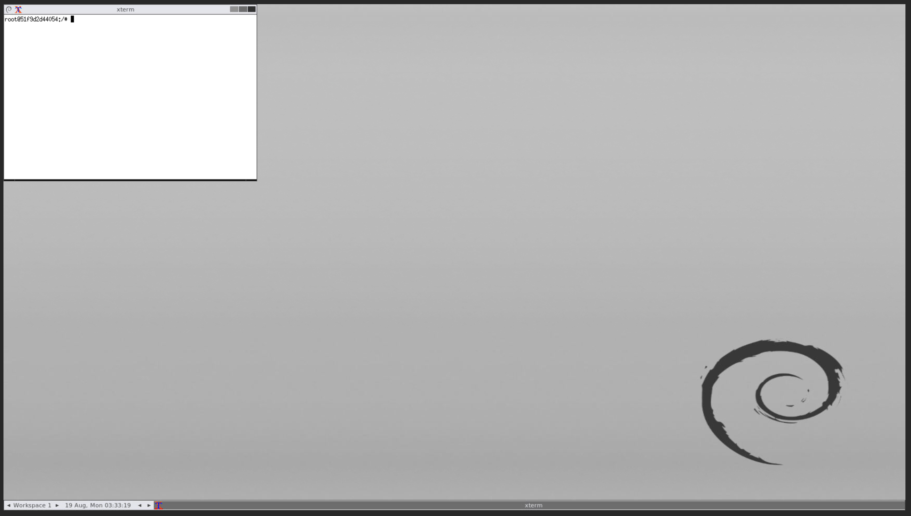
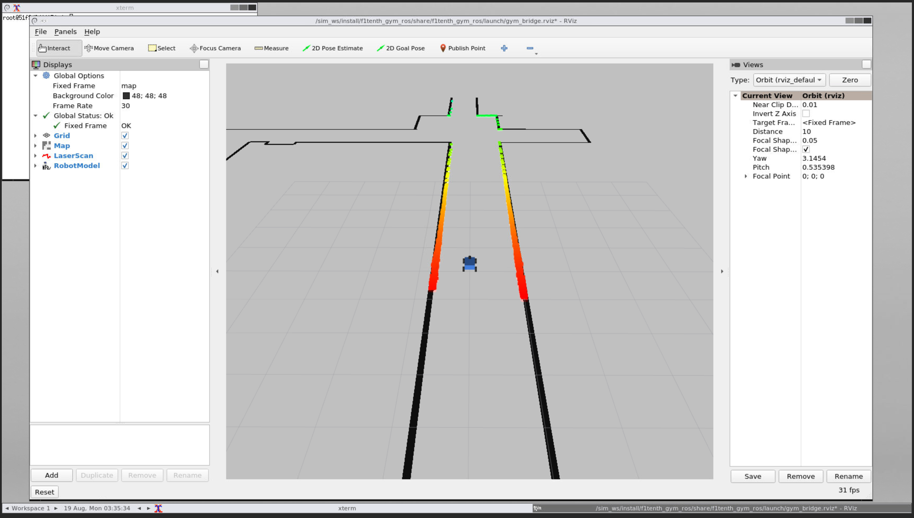

# Lab 1: Intro to ROS 2

## Learning Goals

- Getting familiar with ROS 2 workflow
- Understanding how to create nodes with publishers, subscribers
- Understanding ROS 2 package structure, files, dependencies
- Creating launch files

## Before you start

It's highly recommended to install Ubuntu natively on your machine for
development in simulation. As an alternative, you may use the
simulator within a Docker container. While the F1TENTH group supports
native and containered implementations, at UNLV we are unable to
support both. Our instructions are limited to Docker containers to
support the greatest number of students, but it is highly recommended
that students pursue a native installation from the instructions found
[here](https://github.com/f1tenth/f1tenth_gym_ros). 

These instructions will install the F1TENTH Gym and create a workspace
for this lab in separate locations.

	${HOME}/
	  |
	  +-- sim_ws/
	  |     |
	  |     +-- src/
	  |          |
	  |          `-- f1tenth_gym_ros/        -- The gym
	  |
	  `-- lab1_ws/                           -- This lab
	  
Preparing the gym environment ensures the Docker resources and other
tools are properly installed to prepare the first lab. Keep this
layout in mind while working on the assignment.

## 1. Overview

The goal of this lab is to get you familiar with the ROS 2
workflow. You'll have the option to complete the coding segment of
this assignment in either Python or C++. However, we highly recommend
trying out both since this will be the easiest assignment to get
started on a new language, and the workflow in these two languages are
slightly different in ROS2 and it's beneficial to understand
both. Future labs will provide templates in both.

In this lab, it'll be helpful to read these tutorials if you're stuck:

[https://docs.ros.org/en/foxy/Tutorials.html](https://docs.ros.org/en/foxy/Tutorials.html)

[https://roboticsbackend.com/category/ros2/](https://roboticsbackend.com/category/ros2/)

## 2 Getting ready **(Docker)**

Install Docker on your system following the instructions and
references:

- Docker installation instructions [here](https://docs.docker.com/get-docker/).
- Docker reference documentation [here](https://docs.docker.com/reference/). 

These instructions support all students. Those with an NVIDIA GPU may
wish to follow the installation instructions for the 3D accelerated
simulation enviornment
[here](https://github.com/f1tenth/f1tenth_gym_ros?tab=readme-ov-file#with-an-nvidia-gpu). 

**Install the following dependencies:**

noVNC will be used to forward the display

- Install **Docker** from [here](https://docs.docker.com/get-docker/).
- Install **docker-compose** from
  [here](https://docs.docker.com/compose/install/).

1. Clone the `f1tenth_gym_ros` repository
   [https://github.com/f1tenth/f1tenth_gym_ros] 
   
    ```bash
	cd ~/sim_ws/src/
	git clone https://github.com/f1tenth/f1tenth_gym_ros
	```

2. Start the docker composition

    ```bash
	cd ~/sim_ws/src/f1tenth_gym_ros
	docker build -t f1tenth_gym_ros -f Dockerfile .
	docker compose up
	```

3. In your browser, navigate to
[http://localhost:8080/vnc.html](http://localhost:8080/vnc.html),
you should see the noVNC logo with the connect button. Click the
connect button to connect to the session. If successful, your browser
tab should look similar to to:




## 3. Launching the Simulator

<!-- *xxx-ct the relationship to launching the simulator and tmux is not -->
<!-- clear. Specifically, whether tmux is used in inside or outside of -->
<!-- the container. I have removed the tmux instructions for -->
<!-- now, since they make things less clear. If you would like to revisit -->
<!-- them to aid students that would be fine. Right now it's about getting -->
<!-- up and running.* -->

<!-- 1. `tmux` is included in the container, so you can create multiple -->
<!-- bash sessions in the same terminal.   -->

<!--     - A quick reference on how to use tmux can be found -->
<!-- 	[here](https://www.redhat.com/sysadmin/introduction-tmux-linux).   -->

<!--     - A cheatsheet for the original tmux shortcut keys can be found -->
<!--       [here](https://tmuxcheatsheet.com/). To know about how to change -->
<!--       the configuration of tmux to make it more useable (for example, -->
<!--       if you want to toggle the mouse mode on when you start a tmux -->
<!--       bash session or change the shortcut keys), you can find a -->
<!--       tutorial -->
<!--       [here](https://www.hamvocke.com/blog/a-guide-to-customizing-your-tmux-conf/).  -->

This step verifies the F1TENTH gym simulator has been installed
correctly, for this lab it will not be used but it serves as
verification point.

1. With the docker composition "up" in one terminal, open a second
   terminal and enter the docker container for the simulator.

    ```bash
	docker exec -it f1tenth_gym_ros-sim-1 /bin/bash
	# source /opt/ros/foxy/setup.bash
	# source install/local_setup.bash
	# export PS1="(sim-1) $PS1"
	(sim-1) # ros2 launch f1tenth_gym_ros gym_bridge_launch.py
	```

In your web browser tab for
[http://localhost:8080/vnc.html](http://localhost:8080/vnc.html) an
rviz window should pop up showing the simulation. If successful, your
browser tab should look similar to: 



2. After verifying the simulator is running, stop the container by
   pressing CTRL-C (hold the control key and hit C) in the terminal
   you started it in.
   
    ```bash
	// (sim-1) running the gym_bridge_launch.py ...
	CTRL-C
	(sim-1) # 
	```

## 4. Creating a workspace and bind mounting it into the Docker container

1. Begin by cloning this repository into `~/lab1_ws`
2. Collect your user id and group id with the `id` command by:

    ```bash
	id -u 
	3000 # UID
	id -g 
	4000 # GID
	```

3. With the docker composition 'up', enter the container bind-mounting
   the source repository into the container:

    ```bash
	mkdir ~/lab1_ws/src
	docker run -it -v <abspath>/lab1_ws/src:/lab1_ws/src \
	    --name f1tenth_lab1 ros:foxy
	```

	This will bind mount a directory from the host at
	`<abspath>/lab1_ws/src` to the path `/lab1_ws/src` while starting
	the container. The container will be named `f1tenth_lab1`. You'll 
	then have access to a terminal inside the container. If you wish
	to edit files outside of the container, you will need to change
	the permissions of the files from *inside* the container.

    ```bash
	cd /lab1_ws/src
	chown -R 3000:4000 *        # UID:GID from Step 4.2
	```

    *Note*, you will need to do this for every file created from
	within the container, every time.

`tmux` is recommended when you're working inside a container. It could
be installed in the container via: `apt update && apt install
tmux`. `tmux` allows you to have multiple `bash` session in the same
terminal window. This will be very convenient working inside
containers. A quick reference on how to use tmux can be found
[here](https://www.redhat.com/sysadmin/introduction-tmux-linux). You
can start a session with `tmux`. Then you can call different `tmux`
commands by pressing `ctrl+B` first and then the corresponding
key. For example, to add a new window, press `ctrl+B` first and
release and press `c` to create a new window. You can also move around
with `ctrl+B` then `n` or `p`. 

A cheatsheet for the original tmux shortcut keys can be found
[here](https://tmuxcheatsheet.com/). To know about how to change the
configuration of tmux to make it more useable (for example, if you
want to toggle the mouse mode on when you start a tmux bash session or
change the shortcut keys), you can find a tutorial
[here](https://www.hamvocke.com/blog/a-guide-to-customizing-your-tmux-conf/). 

## 5: ROS 2 Basics

Now that we have the access to a ROS 2 environment, let's test out the
basic ROS 2 commands. In f1tenth_lab1 container terminal, run: 

```bash
# Within the container
source /opt/ros/foxy/setup.bash
ros2 topic list
```
You should see two topics listed:
```bash
/parameter_events
/rosout
```

If you need multiple terminals and you're inside a Docker container,
use `tmux`. 


## 6: Creating a Package

**Deliverable 1**: create a package named `lab1_pkg` in the workspace
we created. The package needs to meet these criteria: 
- The package supports both `Python` and `C++`.
- The package needs to have the `ackermann_msgs` dependency.
- Both of these can be done by declaring the correct dependencies in `package.xml`.
- If declared properly the depencies could be installed using `rosdep`.
- Your package folder should be neat. You shouldn't have multiple
  'src' folders or unnecessary 'install' or 'build' folders. 

1. Create the ROS2 package
```bash
# In Container
root@29629eeaf74a:/# source /opt/ros/foxy/setup.bash
root@29629eeaf74a:/# source /lab1_ws/install/local_setup.bash
root@29629eeaf74a:~# cd /lab1_ws/src/
root@29629eeaf74a:/lab1_ws/src# ros2 pkg create --build-type ament_python lab1_pkg
going to create a new package

>>> SNIP <<<

root@29629eeaf74a:/lab1_ws/src# cd ..
# The following will build any package that is out of date
root@29629eeaf74a:/lab1_ws# colcon build
Starting >>> lab1_pkg
Finished <<< lab1_pkg [0.76s]

Summary: 1 package finished [0.89s]
root@29629eeaf74a:/lab1_ws#
```
2. Verify the package has been properly created and included. The package will not be included until
the workspace has been re-sourced.
  
```bash
#In Container
root@29629eeaf74a:/lab1_ws# ros2 pkg list | grep lab1
root@29629eeaf74a:/lab1_ws#
# Not listed
root@29629eeaf74a:/lab1_ws# source install/local_setup.bash # re-source 
root@29629eeaf74a:/lab1_ws# ros2 pkg list | grep lab1
lab1_pkg
# Now listed
```
3. Using an editor of your choice, edit the package.xml file located within the new package.
Do this out of the container.
```xml
<license>TODO: License declaration</license>

<!-- Begin new tags -->
<depend>rclcpp</depend>
<depend>rclpy</depend>
<depend>ackermann_msgs</depend>
<exec_depend>ros2launch</exec_depend>
<!-- End new tags -->

<test_depend>ament_copyright</test_depend>
```
4. Install the dependencies
```bash
#In Container
root@29629eeaf74a:/lab1_ws# apt-get update

>>> SNIP <<<

Reading package lists... Done
root@29629eeaf74a:/lab1_ws# rosdep install --from-paths src --ignore-src -y
executing command [apt-get install -y ros-foxy-ackermann-msgs]

>>> SNIP <<<

#All required rosdeps installed successfully
root@29629eeaf74a:/lab1_ws#
```
5. Add nodes in the package directory using your editor of choice.
```bash
#OUT of Container
gordon@f1sim:~$ cd /home/gordon/ws/ros_ws/src/lab1_pkg/lab1_pkg
gordon@f1sim:~/ws/ros_ws/src/lab1_pkg/lab1_pkg$ emacs -nw talker.py #vim/nano/emacs/etc.
```


## 7: Creating nodes with publishers and subscribers

**Deliverable 2**: create two nodes in the package we just
created. You can use either `Python` or `C++` for these nodes. 

The first node will be named `talker.cpp` or `talker.py` and needs to
meet these criteria: 
- `talker` listens to two ROS parameters `v` and `d`.
- `talker` publishes an `AckermannDriveStamped` message with the
  `speed` field equal to the `v` parameter and `steering_angle` field
  equal to the `d` parameter, and to a topic named `drive`. 
- `talker` publishes as fast as possible. 
- To test node, set the two ROS parameters through command line, a
  launch file, or a yaml file. 

The second node will be named `relay.cpp` or `relay.py` and needs to
meet these criteria: 
- `relay` subscribes to the `drive` topic. 
- In the subscriber callback, take the speed and steering angle from
  the incoming message, multiply both by 3, and publish the new values
  via another `AckermannDriveStamped` message to a topic named
  `drive_relay`. 

## 8: Creating a launch file and a parameter file
**Deliverable 3**: create a launch file `lab1_launch.py` that launches
both of the nodes we've created. The `talker` accepts two parameters
(`v` and `d`) which must be settable on the command line. Set the 
default values in the launch file to 0.0.

Example instruction:
```bash
ros2 launch lab1_launch.py v:=2.0 d:=3.0 # sets v and d parameters 
```

References to launch files may be found here:
[https://docs.ros.org/en/foxy/Tutorials/Intermediate/Launch/Creating-Launch-Files.html] 

## 9: ROS 2 commands

After you've finished all the deliverables, launch the two nodes and
test out these ROS 2 commands: 

```bash
ros2 topic list
ros2 topic info drive
ros2 topic echo drive
ros2 node list
ros2 node info talker
ros2 node info relay
```

## 10: Deliverables and Submission

Students will maintain a private gitHub repository, cloning this repo and
sharing collaboration rights with the TA. In addition to the three
deliverables described in this document, fill in the answers to the
questions listed in **`SUBMISSION.md`**. Add is as a text file in your
submission. 

Students will add the TA to their labs as a collaborator. The TA's
gitHub: [https://github.com/Breanna-Geller]. 

If you need help, reference the following:
[https://docs.github.com/en/account-and-profile/setting-up-and-managing-your-personal-account-on-github/managing-access-to-your-personal-repositories/inviting-collaborators-to-a-personal-repository] 


## 11: Grading Rubric

- Correctly creating the package: **25** Points
- Correctly creating the nodes: **25** Points
- Correctly creating the launch file: **25** Points
- Written questions: **25** Points

## Troubleshooting

### Cannot use the container

If there are problems entering or exiting the docker container, remove
it: 

```bash
docker container rm f1tenth_lab1
```

### Re-entering the container after exiting

```bash
docker start f1tenth_lab1
docker attach f1tenth_lab1
```

### Exiting the container

To exit the container hold down the control key and press the d key.
